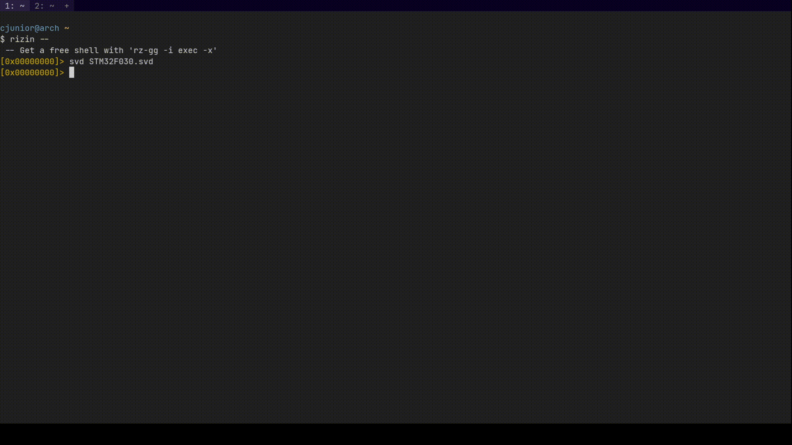

# rz-svd :pager:

[](https://github.com/officialcjunior/rz-svd/actions)

rz-svd is an SVD loader for Rizin.

SVD files are files containing information about a device's peripherals, MMIO registers and other particulars. This plugin
can be used to load the data from SVD file to Rizin and add them as flags(labels) and comments, simplifying the reverse 
engineering experience.



## Installation :cd:

To compile from source, you will need the `meson` build system.

```bash
meson --buildtype=release --prefix=~/.local build
ninja -C build
ninja -C build install
```
Or, you can get the pre-compiled file from [Releases](https://github.com/officialcjunior/rz-svd/releases).

## Usage :electric_plug:

```bash
$ rizin --
[0x00000000]> svd
Usage: svd <Path to the SVD file>   # SVD Plugin for Rizin
[0x00000000]> svd STM32F030.svd
```